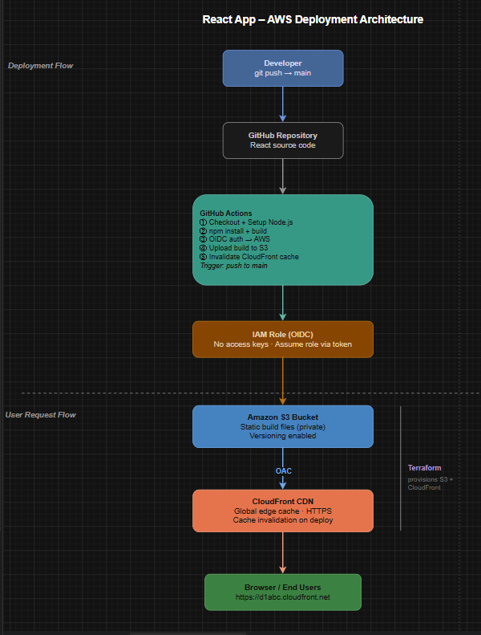

# Cloud Academy - React App AWS Deployment

## 🚀 Project Overview

This project is the final CI/CD and Infrastructure lab for Cloud Academy. 
The objective of this project is to deploy a React-based marketing website to AWS using **Terraform** for Infrastructure as Code (IaC) and **GitHub Actions** for an automated CI/CD pipeline. The deployment follows best practices, including secure authentication to AWS using **OIDC** (without long-lived IAM Access Keys).

---

## 🌐 Website URL

You can access the live application here:
**[Cloud Academy React App - Live Site](https://d37xvh01jlof8k.cloudfront.net)**

---

## 🏗️ Architecture Diagram

*(Please make sure you have the `architecture.png` or `architecture.drawio.png` file in this folder for the diagram to show up!)*



### 🌩️ AWS Components Explanation

* **GitHub Actions**: The CI/CD runner that builds the React code, authenticates to AWS via OIDC, uploads the static files to S3, and invalidates the CloudFront cache.
* **IAM Role & OIDC Provider**: Allows GitHub Actions to assume a temporary, secure role to perform actions in AWS without the need to store static AWS Access Keys in GitHub Secrets.
* **Amazon S3 (Simple Storage Service)**: A private storage bucket used to store the compiled static files of the React application (HTML, CSS, JS). Direct public access is blocked.
* **Amazon CloudFront**: A global Content Delivery Network (CDN). It fetches the website files from the private S3 bucket using an Origin Access Control (OAC) and caches them at edge locations worldwide for fast, secure (HTTPS) delivery to users.

---

## ⚙️ Deployment Instructions

### Prerequisites
- [Terraform](https://developer.hashicorp.com/terraform/downloads) installed locally.
- AWS CLI installed and configured with your account credentials.
- A GitHub repository for your project.

### 1. Infrastructure Deployment (Terraform)
Navigate to the `terraform` directory:
```bash
cd terraform
```
Initialize the Terraform project to download the required providers:
```bash
terraform init
```
Review the planned infrastructure changes:
```bash
terraform plan
```
Apply the configuration to create the AWS resources:
```bash
terraform apply
```
*Note: Make sure to copy the output values (S3 Bucket name, CloudFront ID, and IAM Role ARN) for the CI/CD pipeline.*

### 2. CI/CD Pipeline (GitHub Actions)
The deployment is fully automated! 
Any `git push` to the `main` branch will automatically trigger the GitHub Actions workflow located in `.github/workflows/deploy.yml`. 
The workflow will:
1. Build the React App.
2. Assume the AWS IAM Role via OIDC.
3. Sync the `dist` folder to the S3 Bucket.
4. Invalidate the CloudFront cache to serve the latest version.
